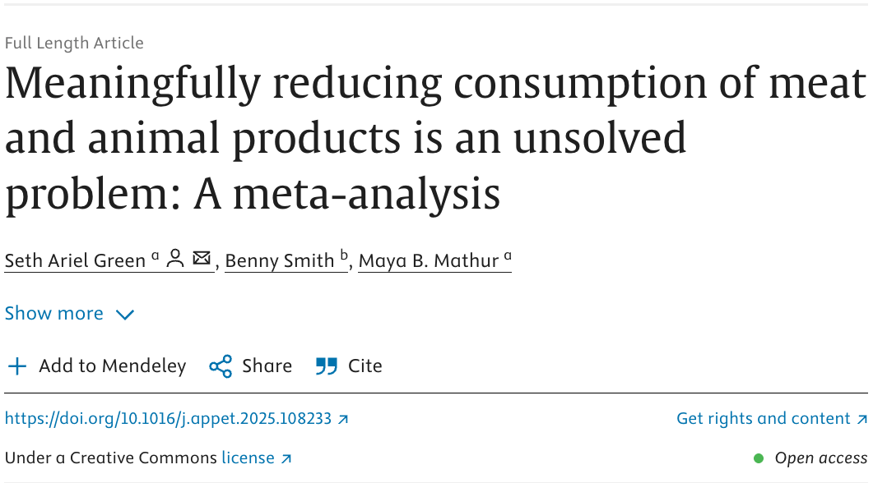
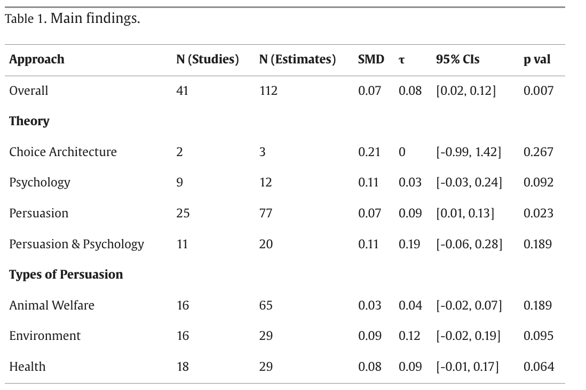

```{r setup, include=FALSE}
knitr::opts_chunk$set(echo = FALSE)
```

## Fact 1: meat consumption is rising across every category

\href{https://ourworldindata.org/grapher/per-capita-meat-consumption-by-type-kilograms-per-year}{\includegraphics[height=0.78\textheight]{images/meat-consumption-go-up.png}}

## ...everywhere

\href{https://ourworldindata.org/meat-production}{\includegraphics[height=0.78\textheight]{images/meat-consumption-go-up-everywhere.png}}

## Fact 2: people think eating meat is fine

\begin{center}
\includegraphics[height=0.78\textheight]{images/american-attitudes-moral-issues.png}
\end{center}

## Fact 3: transformational effects don't get discovered in the social sciences because they're already obvious

Daniel Lakens, [talking about a putative effect size of d = 2](https://daniellakens.blogspot.com/2017/07/impossibly-hungry-judges.html) (the effect of hunger on judge's behavior):

> "If hunger had an effect on our mental resources of this magnitude, our society would fall into minor chaos every day at 11:45...Just like manufacturers take size differences between men and women into account when producing items such as golf clubs or watches, we would stop teaching in the time before lunch, doctors would not schedule surgery, and driving before lunch would be illegal. **If a psychological effect is this big, we don't need to discover it and publish it in a scientific journal --- you would already know it exists.**"

## So how about this meta-analysis 

::::: columns
::: {.column width="38%"}
- I worked on a [meta-analytic review](https://doi.org/10.1016/j.appet.2025.108233) of interventions to get people to eat less MAP.

- We only looked at rigorous studies (RCTs with \> 50 subjects that measured MAP consumption directly at least a day after treatment began)

- As of 12/2023, 35 papers met our criteria
:::

::: {.column width="62%"}
{width="100%"}
:::
:::::

## What interventions have been tried?

::: columns
:::: {.column width="42%"}
\footnotesize
* Almost everything tries to:
  - Tell people meat is bad (environmental/health/animal welfare)
  - Make plant-based options more salient (eye-level on menus)
  - Make animal-based options less convenient
  - Tell people plant-based options are tasty and popular
  - Exploit psychological tendencies (social norms, commitment)
* Overall, small & sparse effects

::::
:::: {.column width="58%"}

{width=100%}

::::
:::

## Choice architecture in particular: very few credible designs

::: columns
:::: {.column width="45%"}

- Only 2 studies, 3 estimates in our sample
- Most studies lack real-world follow-up: we don't know if cafeteria-based nudges change what people actually buy over time
- Lab and online studies dominate; field evidence is thin
- Pooled SMD = 0.21, but CI includes 0 ($[-0.99, 1.42]$) because there are, again, two papers

::::
:::: {.column width="55%"}

\includegraphics[height=0.58\textheight]{images/example-nudge.png}

\scriptsize example menu from [Andersson, O., & Nelander, L. (2021). Nudge the lunch: A field experiment testing menu-primacy effects on lunch choices. *Games*, 12(1), 2.](https://doi.org/10.3390/g12010002)

::::
:::

## Hi Isabel :)

- Time to stir the pot!
- What you call field experiments, I would call field _studies_. An experiment needs random assignment IMHO
- Looking through your citations, _are_ there any experiments that measure outcomes with any delay at all? I think [Ginn & Sparkman (2024)](https://doi.org/10.1016/j.jenvp.2023.102226) is the only one that even theoretically would qualify and I think it's outside your time period
- Also, what's a nudge? e.g., Coker et al. (2022), "[A dynamic social norm messaging intervention to reduce meat consumption: A randomized cross-over trial in retail store restaurants](https://pubmed.ncbi.nlm.nih.gov/34826525/)."

## But most importantly

- It's really hard to gauge how much we should buy the causal assumptions in non-randomized before-after papers
- Often it's clear that a lot of things changed, e.g. the number of meals served changes dramatically between periods
- Question for Isabel/anyone: _should_ we grant these identification strategies the benefit of the doubt? I say no, the default is to assume bias, and effect sizes are typically small so a little bias can easily create [type S (sign) errors](https://sites.stat.columbia.edu/gelman/research/published/retropower20.pdf).
- What do you all think?

## Conclusion: meaningfully reducing consumption of meat and animal products is an unsolved problem

- A lot of advocates want a villain, e.g.  big bad meat corporations, so we can say, if not for Tyson, we'd be winning, grr!! 
 
- I don't think that's the right model. There's no Lex Luthor here. People just really like meat

- And they don't care enough about how it's raised to pay attention to it or pay higher prices for the better version

- Our challenge is to persuade them otherwise. To quote Lester Freamon on _The Wire_, "Detective, this right here, _this_ is the job." It's just going to be a lot of work.

